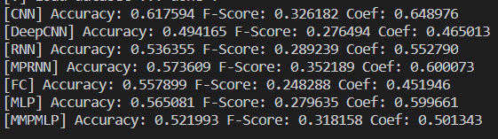

需要GPU

本仓库中不包含数据集、预训练模型、word embedding，完整版见https://cloud.tsinghua.edu.cn/d/f703c7e2f04a49bfbb90/

训练：

```bash
cd src
python main.py --args
```

可参考main.py开头的声明输入备选参数

测试：

```bash
cd src
python inference.py
```

输出：



若只想对单个模型进行测试，则加入参数--model=模型名